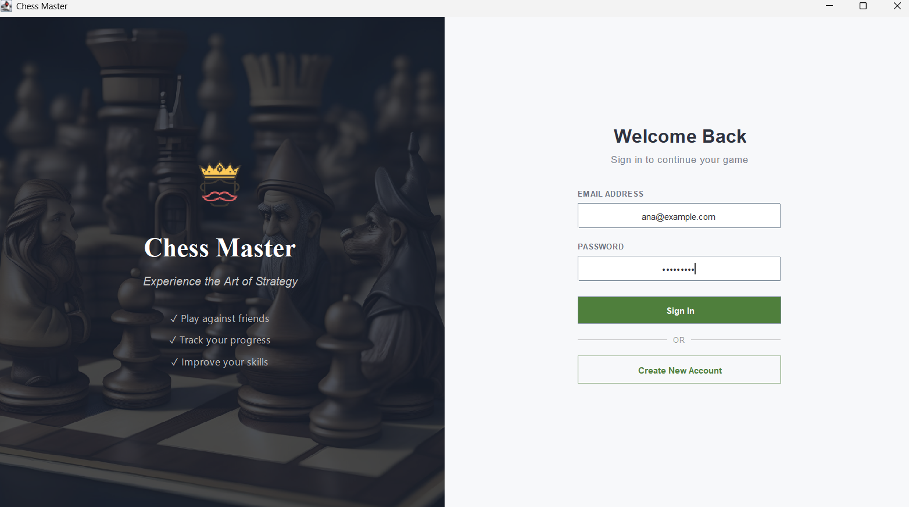
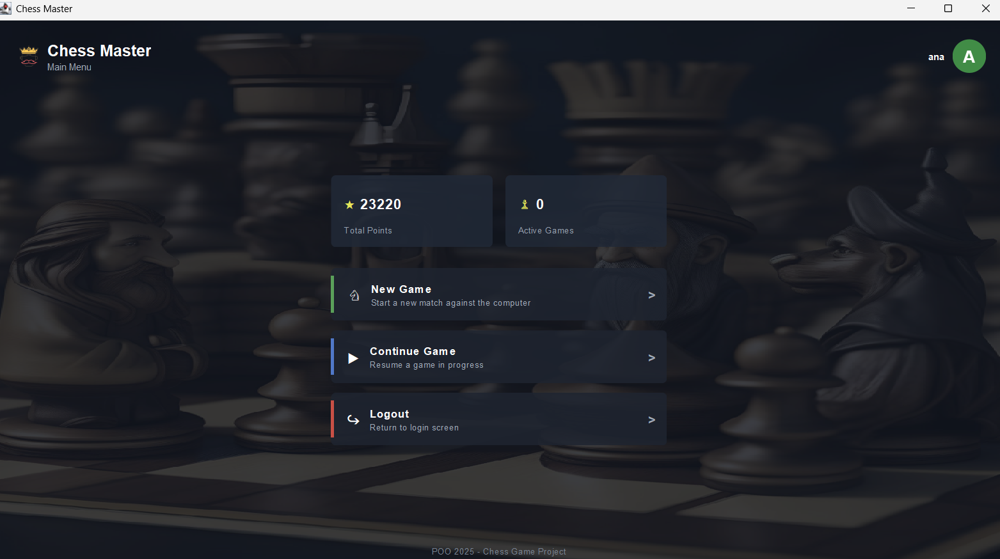
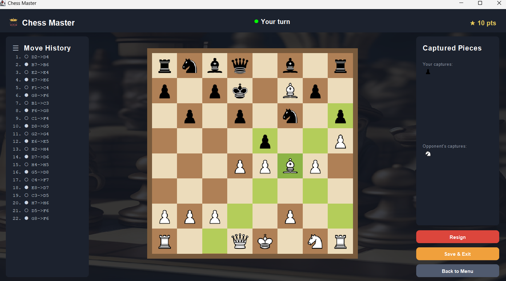
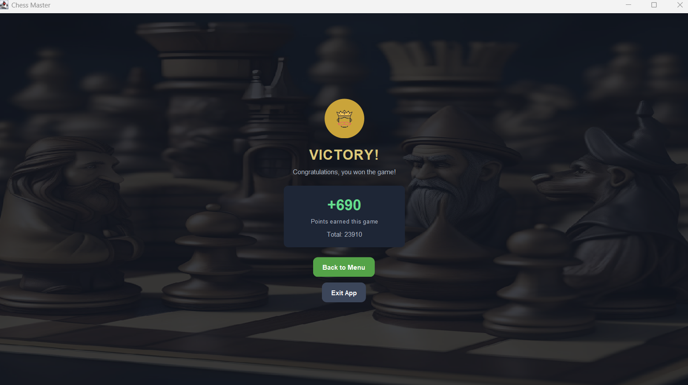
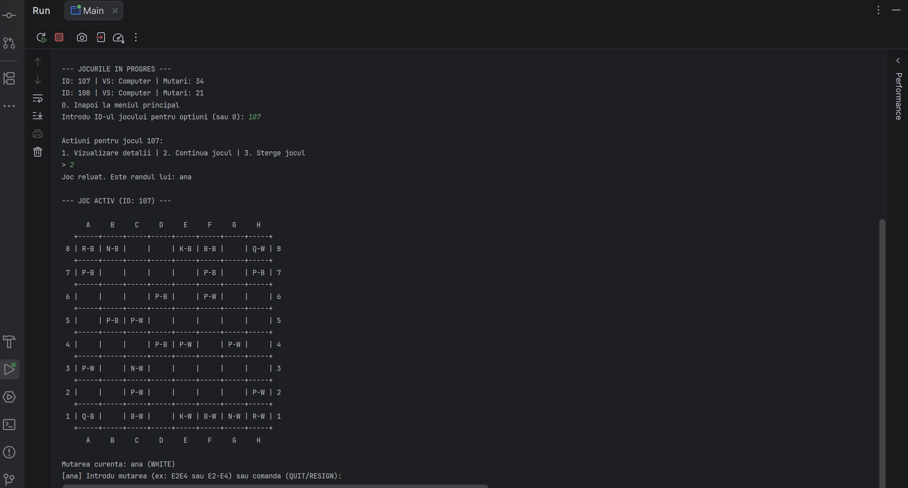
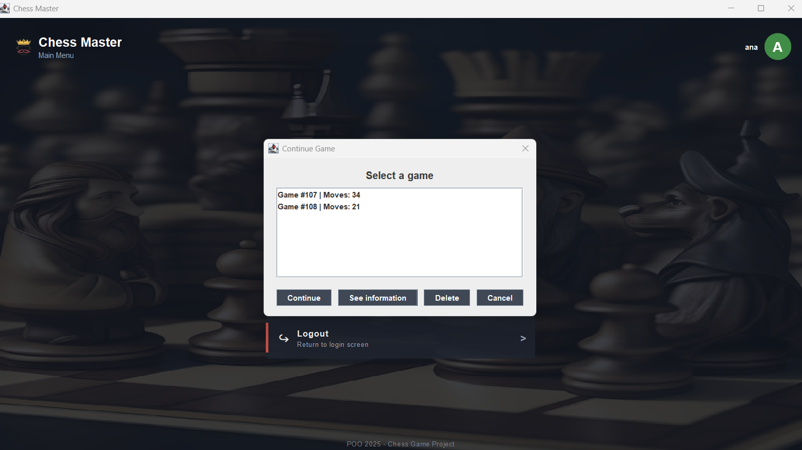
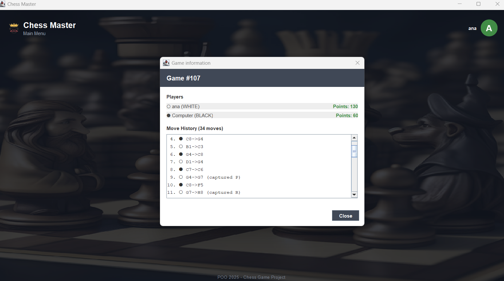

# ♟️ chess-game

A fully playable chess game built in Java, supporting both a **terminal** and a **graphical (Swing) interface**. Players compete against a computer opponent, with game state persisted across sessions via JSON.
 
---

## Screenshots

<table>
  <tr>
    <td width="50%">
      
      <p align="center">Login screen</p>
    </td>
    <td width="50%">
      
      <p align="center">Main menu</p>
    </td>
  </tr>
  <tr>
    <td width="50%">
      
      <p align="center">GUI — gameplay with move highlighting</p>
    </td>
    <td width="50%">
      
      <p align="center">Result screen — checkmate</p>
    </td>
  </tr>
  <tr>
    <td width="50%">
      
      <p align="center">Terminal mode</p>
    </td>
    <td width="50%">
      
      <p align="center">Active games list</p>
    </td>
  </tr>
  <tr>
    <td colspan="2" align="center">
      
      <p align="center">Game details — move history and board state</p>
    </td>
  </tr>
</table>
 
---

## Features

- **Two play modes** — terminal (text-based) and GUI (Java Swing)
- **Player vs Computer** — computer plays random valid moves
- **Full chess rule enforcement** — check, checkmate, stalemate, draw by repetition, pawn promotion
- **Scoring system** — points for captures and end-game bonuses/penalties
- **User accounts** — login, register, and track total points across games
- **Game persistence** — save and resume games between sessions (JSON)
- **Move history** — logged in real time during gameplay
- **Multiple active games** — manage and switch between ongoing games
---

## Design Patterns

| Pattern | Where |
|---|---|
| **Factory** | `PieceFactory` — centralised creation of all chess pieces |
| **Strategy** | `MoveStrategy` per piece type · `ScoringStrategy` for points calculation |
| **Observer** | `CheckObserver`, `LoggerObserver`, `ScoreObserver`, `GuiObserver` |
| **Singleton** | `Main` — single application entry point managing global state |
 
---

## Project Structure

```
src/
├── main/           # Entry point (Singleton)
├── controller/     # TerminalController, GuiController
├── game/           # Board, Game, Player, Move, User
├── model/          # Piece (abstract), Position, Colors, ChessPair
├── pieces/         # Pawn, Rook, Bishop, Knight, Queen, King, PieceFactory
├── strategies/     # MoveStrategy implementations, ScoringStrategy, EndGameCondition
├── observers/      # GameObserver interface and all observer implementations
├── ui/             # Swing panels: MainFrame, GamePanel, LoginPanel, MenuPanel, ResultPanel
├── utils/          # JsonReaderUtil, UserUtils
├── exceptions/     # InvalidMoveException, InvalidCommandException, GameFlowControlException
└── test/           # Unit tests, scenario tests, interactive demos
input/
├── accounts.json   # Persisted user accounts
└── games.json      # Persisted game states
assets/
├── pieces/         # PNG and SVG images for all chess pieces
├── photos/         # Background image
└── screenshots/    # Application screenshots
```
 
---

## Getting Started

### Prerequisites

- Java 11 or higher
- An IDE such as IntelliJ IDEA (recommended) or compile manually with `javac`
### Run in IntelliJ

1. Clone the repository
   ```bash
   git clone https://github.com/krpandrei05/chess-game
   ```
2. Open the project folder in IntelliJ IDEA
3. Make sure `json-simple-1.1.1.jar` is added to the project classpath
    - Go to **File → Project Structure → Modules → Dependencies** and add the JAR
4. Run `src/main/Main.java`
5. Choose mode: `1` for Terminal, `2` for GUI
### Run from terminal (manual compile)

```bash
javac -cp json-simple-1.1.1.jar -sourcepath src -d out src/main/Main.java
java -cp out:json-simple-1.1.1.jar main.Main
```

> On Windows, replace `:` with `;` in the classpath.
 
---

## How to Play

**Terminal mode**
- Enter moves in the format `E2E4` or `E2-E4`
- Type a single square (e.g. `E2`) to see valid moves for that piece
- Type `RESIGN` to forfeit, `QUIT` to save and exit
  **GUI mode**
- Click a piece to select it — valid moves are highlighted
- Click a destination square to move
- Use the on-screen buttons to resign or quit
---

## Scoring

| Event | Points |
|---|---|
| Capture pawn | +10 |
| Capture bishop / knight | +30 |
| Capture rook | +50 |
| Capture queen | +90 |
| Win by checkmate | +300 |
| Lose by checkmate | −300 |
| Draw / opponent resigns | +150 |
| Own resignation | −150 |

Points from all games accumulate on the user account.
 
---

## Known Limitations

- No **castling** or **en passant**
- Computer plays randomly (no AI evaluation)
- No online/multiplayer support
---

## Academic Context

This project was developed as part of the **Object-Oriented Programming (OOP)** course at the **Faculty of Automatic Control and Computers (CTI)**, Politehnica University of Bucharest (UPB).